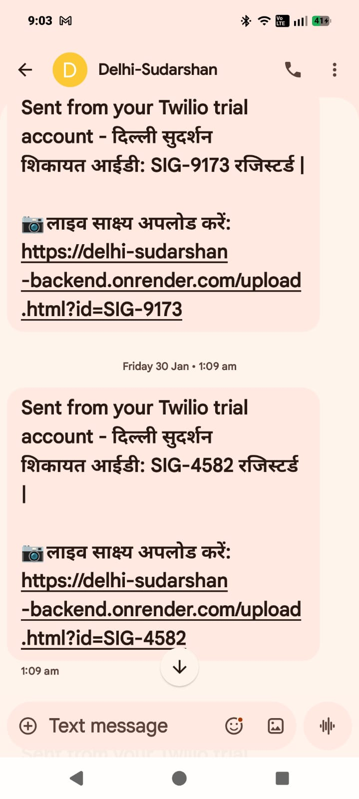

  
  
  <h1>दिल्ली SUDARSHAN | Future Governance</h1>
  
  <strong>Bridging Voice to Vision — An AI-Powered Civic Command Center</strong>
    
  
  
  
  

  

    A next-generation governance OS for the <strong>Government of NCT of Delhi</strong>.  
    Features <strong>"Legacy Tunneling"</strong> architecture, <strong>"Citizen Feedback Loop"</strong> verification loops, and <strong>Zero-UI</strong> citizen interaction.
  

   
  

   

  <h3>🎙️ VAANI (Voice Agent)</h3>
  <a href="https://vaani-khaki.vercel.app/" style="font-size:1.1em; font-weight:600; color:#007bff; text-decoration:none;">vaani-khaki.vercel.app</a>
  

    <strong>Open this on a mobile device</strong> to see how a citizen can register a complaint through our AI voice agent.
  

   

  <h3>📞 CITIZEN CALL DEMO</h3>
  <a href="https://delhi-sudarshan-backend.onrender.com/citizen.html" style="font-size:1.1em; font-weight:600; color:#007bff; text-decoration:none;">delhi-sudarshan-backend.onrender.com/citizen.html</a>
  

    <strong>Open this on a mobile device</strong> to receive the verification call from the AI.
  

---

## 🚀 Overview

**Delhi Sudarshan** is a centralized command center designed to streamline public grievance redressal. Unlike traditional apps that require citizens to be tech-savvy, Sudarshan uses a **Voice-First (Zero-UI)** approach. 

It acts as an **intelligent middleware** that tunnels into existing government legacy databases, enabling real-time AI surveillance, corruption checks, and instant citizen communication without requiring expensive data migration.

### 🔗 [**CLICK HERE TO VIEW LIVE DASHBOARD**]https://delhi-sudarshan-frontend.vercel.app/ 

**FRONTEND REPO:** [Click Here](https://github.com/jatinkhandelwal662-jk/Delhi-Sudarshan)
 
**VAANI REPO:** [Click Here](https://github.com/jatinkhandelwal662-jk/Vaani)
 
**BACKEND REPO:** [Click Here](https://github.com/jatinkhandelwal662-jk/Delhi-Sudarshan-backend) 

---

## ✨ Key Features (The USP)

### 🎙️ Zero-UI Accessibility
* **No App Required:** Designed for the 47% of the population that is elderly or digitally illiterate.
* **Language Agnostic:** The system speaks fluid Hindi and English, bridging the digital divide.

### ✅ The "Citizen Feedback Loop"
* **Closing the Loop:** The system ensures that a complaint isn't just "Closed" in the database, but truly "Resolved" on the ground. It creates a digital chain of trust between the government and the citizen.
* **AI-Driven Service Validation:** The Nodal Officer acts as a quality controller. With a single click, the AI Agent conducts a "Satisfaction Check" by calling a specific citizen group to confirm the resolution meets their expectations.
* **Gap Analysis & Auto-Reopen:** If citizens report that the issue persists, the system identifies the service gap and automatically re-opens the tickets for priority attention. This guarantees 100% service delivery without manual field visits.

### 🚇 Legacy Tunneling Architecture
* **Zero-Migration:** Instead of replacing old government SQL servers (which is costly and slow), Sudarshan acts as a **Stateless Overlay**.
* **Seamless Integration:** It "tunnels" into legacy MCD/PWD databases to read/write data, allowing for instant deployment at 10% of the cost of traditional digital transformation.

### ⚡ Sub-500ms Latency (Real-Time)
* **Gemini 2.5 Native Audio:** We bypass traditional Speech-to-Text delays. By streaming raw audio tokens, our voice agent (`Vaani`) responds in **under 500ms**, making the conversation feel natural and human-like during emergencies.

### 🛡️ Human-in-the-Loop (Ethical Guardrails)
* **AI Efficiency, Human Authority:** The AI autonomously handles intake, categorization, department routing, and priority verification. However, it **cannot reject** a complaint.
* **Mandatory Officer Review:** The power to reject is strictly reserved for the Nodal Officer. If a complaint is invalid, the officer must manually reject it and record a specific reason. 
* **Automated Feedback:** Once rejected by the officer, the AI Agent immediately calls the citizen to explain the specific reason for rejection, ensuring total transparency.

### 📞 Proactive "Don't Call Us" Model
* **Outbound-First Communication:** We flipped the traditional model. Citizens do not need to call daily to check their status.
* **Event-Triggered Updates:** The AI Agent (`Vaani`) proactively calls the citizen **only** when a significant status change occurs (Solved, Rejected, Audit, or Overdue). This reduces anxiety for the citizen and call volume for the department.

---

## 📡 Dashboard Capabilities

* **Mission Control:** A futuristic **Glassmorphism-based** dashboard displaying live city stats, resolution rates, and pending tickets.
* **Live Signals:** Real-time feed of incoming voice complaints with status indicators (Overdue, Solved, Pending).
* **Department Analytics:** Interactive visualization (Chart.js) to monitor the performance load of **PWD, DJB, BSES, and MCD**.
* **Notification Center:** Live pop-up alerts for new complaints and evidence uploads.
* **Officer Profile:** Digital verification profile for the nodal officer with secure access levels.

---

  <strong>📱 SMS Acknowledgement Demo</strong> 
  <em>After a citizen registers a complaint on <b>Vaani</b>, an instant SMS is sent to the registered mobile number to acknowledge the complaint. Below is a real screenshot of the SMS received:</em>
    
  
   
  <em>
    The SMS contains: 
    — Complaint ID (शिकायत आईडी) 
    — A secure upload link for photo evidence (<b>लाइव साक्ष्य अपलोड करें</b>) 
  </em>

---

## 📍 Operational Strategy: Zonal Decentralization

To ensure rapid response times and pinpoint accountability, we have moved away from a single "clogged" central helpline. **Delhi Sudarshan** implements a **Hyper-Local Operational Model** by dividing the capital into four strategic zones:

### 🧭 The 4-Zone Command Structure
* **South Zone | North Zone | East Zone | West Zone**
* Each zone is assigned a **Dedicated "Delhi Sudarshan" Helpline Number**.

### 🚀 Why This Matters?
* **High-Speed Response (Load Balancing):** By distributing call volume across four distinct nodes, we prevent system crashes during high-volume events (e.g., monsoon waterlogging) and ensure citizens never face a "Line Busy" tone.
* **Pinpoint Accountability:** Complaints are instantly mapped to the specific Zonal Nodal officer. This eliminates "passing the buck" between departments, as the jurisdiction is locked at the moment of the call.
* **Rapid Mobilization:** The Zonal AI Agent dispatches tickets directly to the nearest local field unit, bypassing central routing delays and cutting reaction time by 40%.

---

## 🛠️ Tech Stack

* **Frontend:** HTML5, CSS3 (Glassmorphism), JavaScript (ES6+), Chart.js
* **Backend:** Node.js, Express.js (Stateless Middleware)
* **AI Core:** Google Gemini 2.5 Flash (Native Audio-to-Audio Processing)
* **Telephony:** Twilio Voice SDK (WebRTC) & Programmable SMS
* **Deployment:** GitHub Pages (Frontend) + Render (Backend) + Vercel(AI-Voice Agent)

---

## Team TARS:

* Riya Sharma
* Khushi Dalal
* Jatin Khandelwal
* Bhavishya Bhati

---

  
<em>Giving a voice to the unheard. Dedicated to the service of the Nation and the people of Delhi.</em>

  
<strong>"We do not force the citizen to learn technology; we force technology to adapt to the citizen."</strong>

